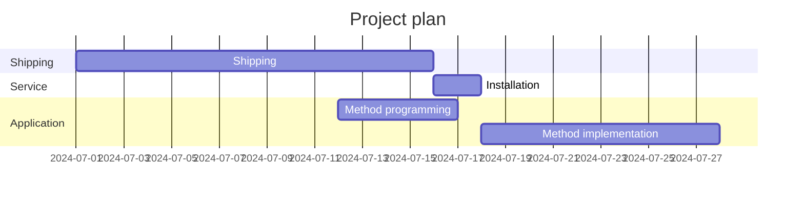

### About me...




Please check out my [ LinkedIn](https://www.linkedin.com/in/jacob-hald-b939933)  to get in contact with me or see more about my professional experience.
<table>
  <tr style="background-color:red" >  test </tr>
  <td>  test2 </td>  
</table>
  
  <p>
  <span style="color:blue">some *blue* text</span>
  </p>
  
  
```diff
- text in red
+ text in green
! text in orange
# text in gray
@@ text in purple (and bold)@@
```

<html>

<div class="text-white bg-blue mb-2">
  .text-white on .bg-blue
</div>
  
  <div style="background-color: #cfc ; padding: 10px; border: 1px solid green;">
    
  <p stlye="color:blue"> Test <p>
       
</html>
  
[Back to main](https://haldinc.github.io/)
