# AmongUs 2021  

As the kids like **Among Us** and wanted their own emergency meeting bottom like the one from the game / cartoon:  
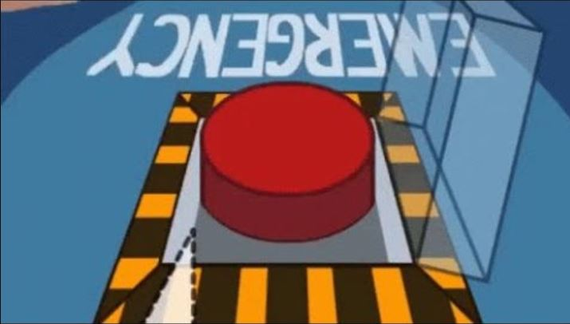

You know, just in case they suspect someone in the apartment is a murder and need a meeting…   Anyway, the kids and I started to draw some sketches and I designed this in Fusion 360 according to the kid's specification. 

Time to start printing:

table {
  border: 1px solid red;
}
td {
  padding: 10px 0;
}
img {
  width: 100px;
  height: 100px;
  display: block
}

<table>
  <tr>
    <td>Text
      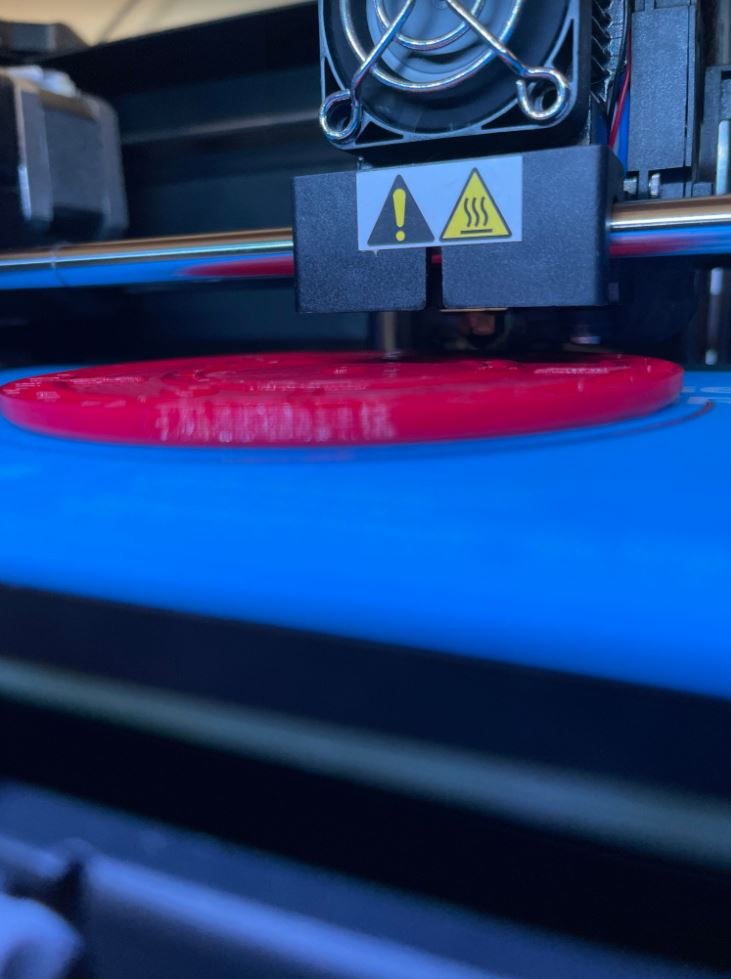Text</td>
    <td>Text
      Text</td>
  </tr>
  <tr>
    <td>Text
      Text</td>
    <td>Text
      Text</td>
  </tr>
</table>

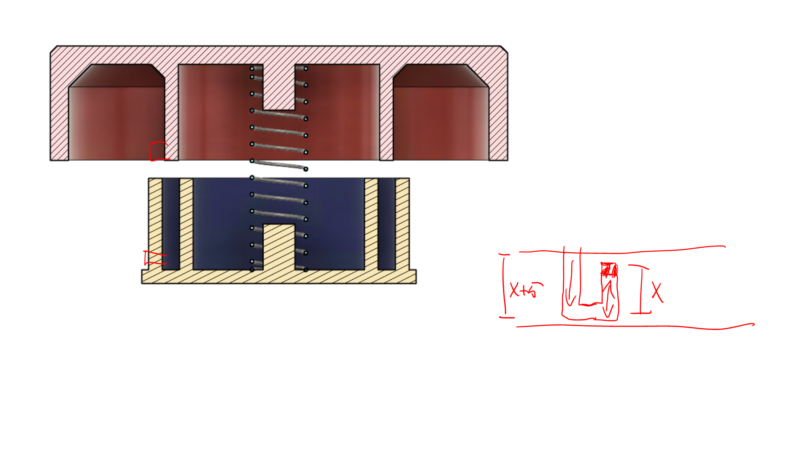
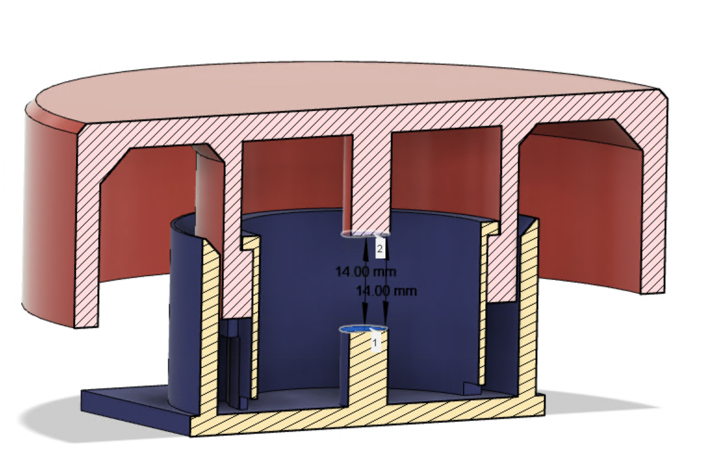
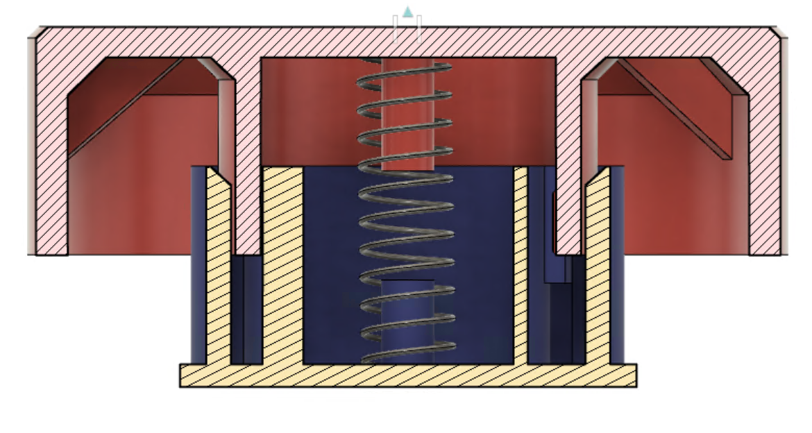

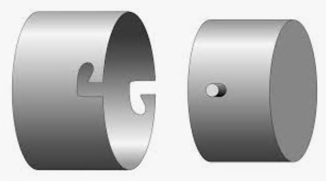

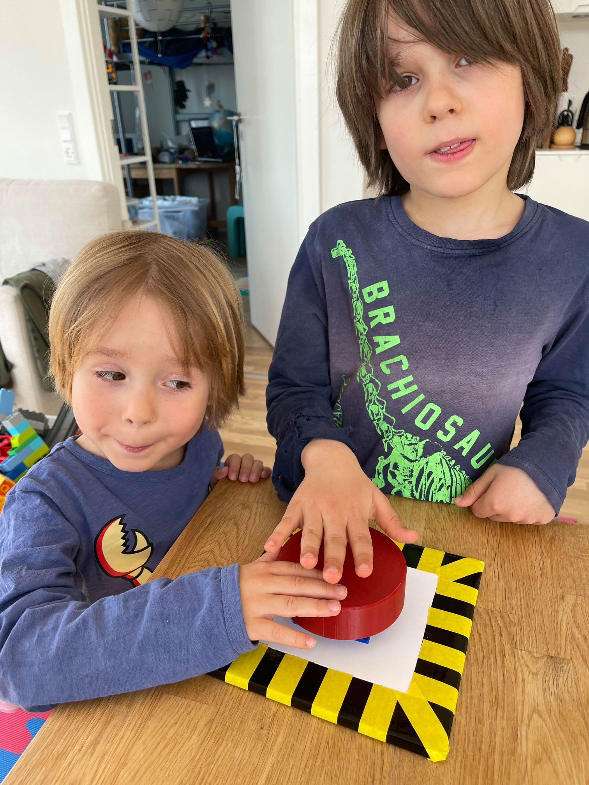

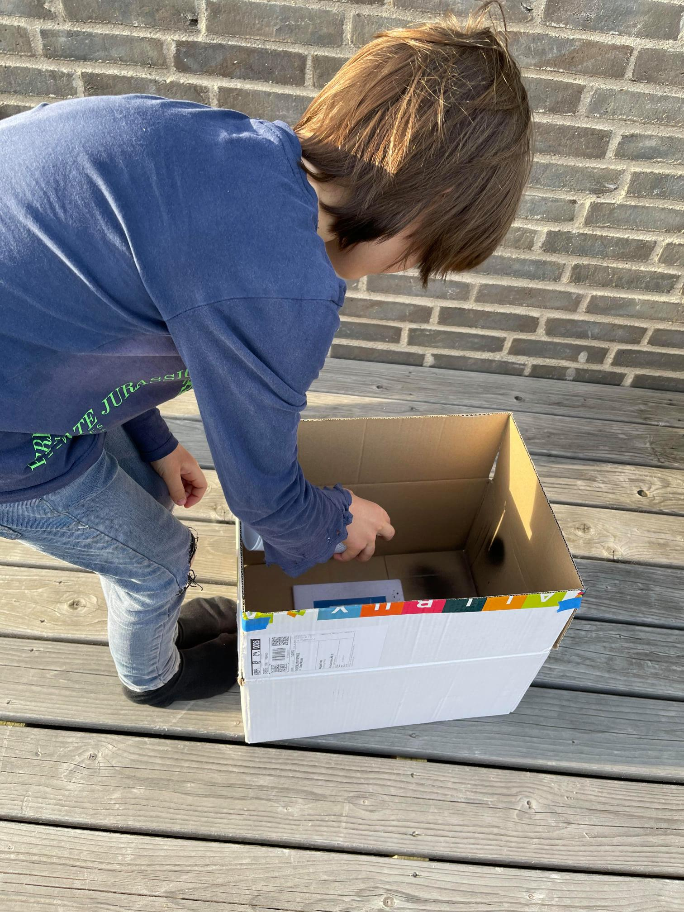

It fulfills the kid’s specifications, but I am not too happy as the two parts can get stuck if you push it down too much off-center.  
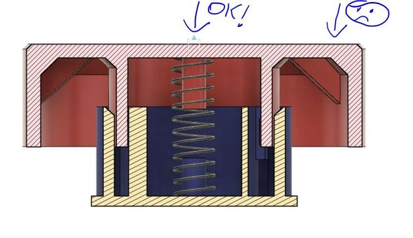

A bit of sanding fix it, but if I should ever redesign a large pushbutton, I would put the support closer to the edge. Not really a surprise, but another lesson learned. :)  

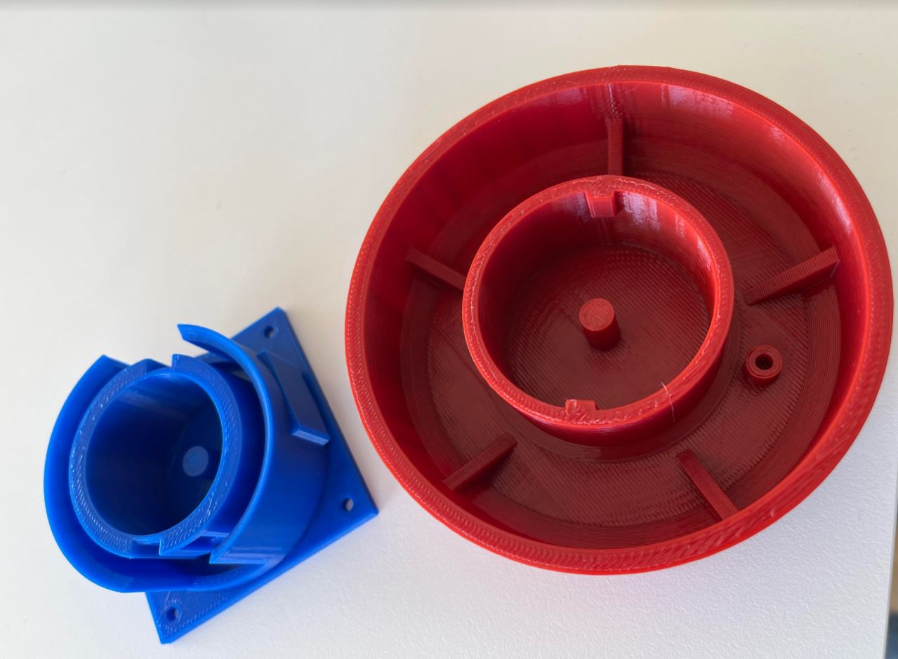
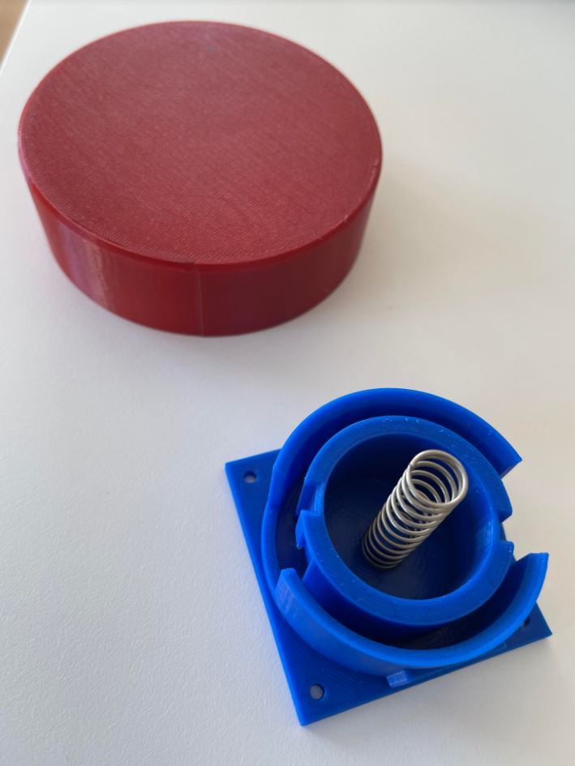

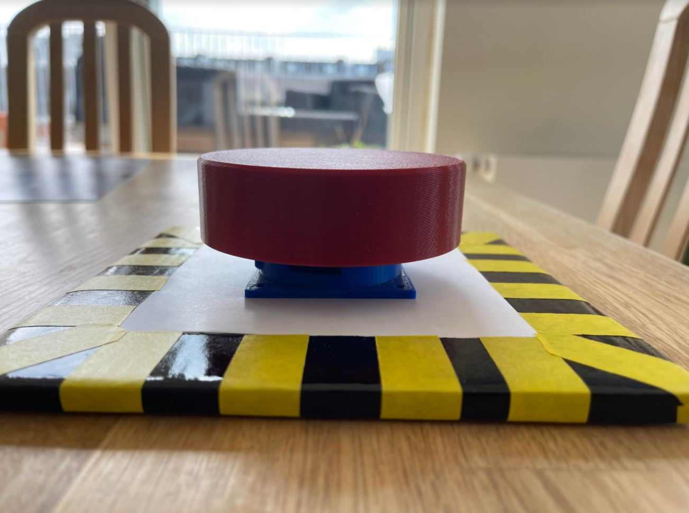

<video width="320" height="240" controls>
  <source type="video/mp4" src="2021-04-20_16h59_06.mp4">
</video>

