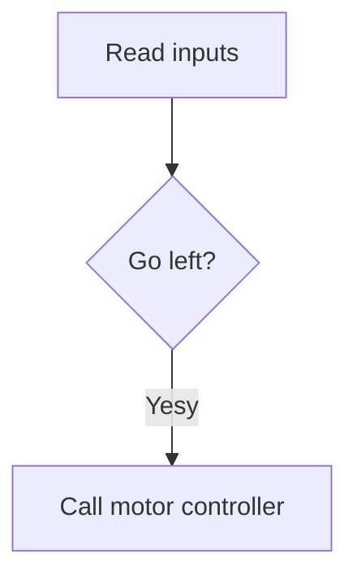

# Claw machine project 2024:

<video width="320" height="240" controls>
  <source src="IMG_8425.MOV" type="video/mp4">
</video>

## Processor I/O Map:

## Processor I/O Map:

This is my CAD render of the motor assembly for the X axis:

