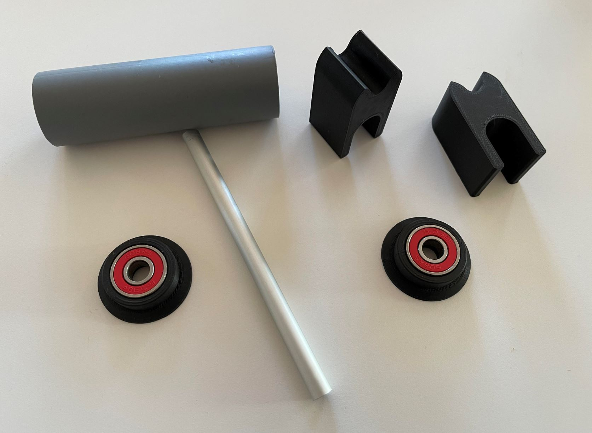

# Project:  Filament spool roller - June 2021

This is a small afternoon project to "upgrade" my Flashforge 3D printer, so I can swap the filament spool fast and easy and make sure it run nearly frictionless. The Flashforge design is working great out-of-the-box for their filament spools, but due to limited space, my printer is up agenst a wall and replacing spools is a pain. Therefore I always have two of my standard filaments installed here and pulled others from the side - if I need anything else.

I know - you can buy a finished solution for this, but seriously - what is the fun with that? ..and using 608 ball bearings is overkill, but hey - when you have plenty of them at home, why not use them. 

All CAD design and rendering is done in Autodesk Fusion 360.

### Rendering of the concept:

### Section analysis:

### Parts:
All the black parts are 3D printed in matte black filament. The 608 ball bearings are press-fitted.  
The tube is cut from PVC.  
Ø8mm aluminium rod.   

### Real photo of the final result:

### In use:
Simple and easy solution.  

