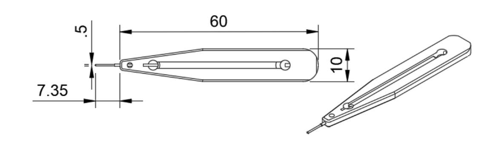
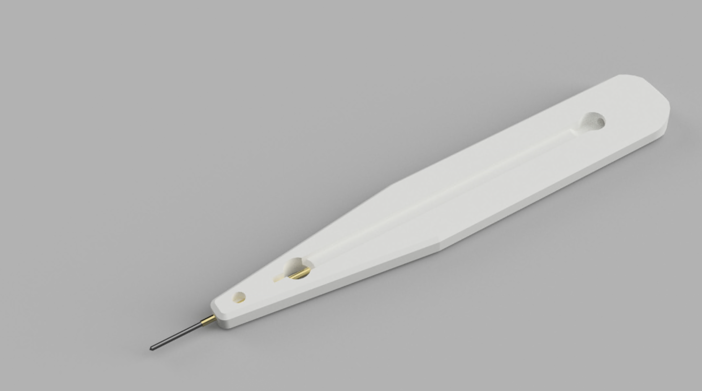
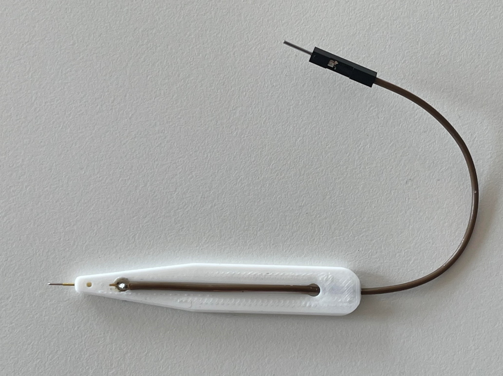
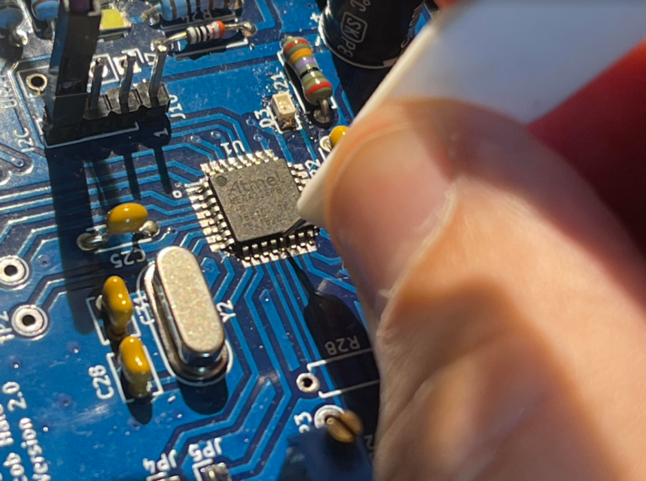

# Pogo pin SMD probe 2021

Yet another fast 3D printed project. For debugging an embedded design I am working on, I needed a very fine and slim probe. As I also had some pogo pins I designed a small holder so I can easily hold this onto the pin I need to test.  

Material:  PLA    -  Print time: 15 min

My rendering in Autodesk Fusion 360: 

The 3D printed version after mounting the pogo pin and soldering the wire.

Testing:

