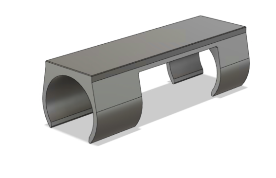
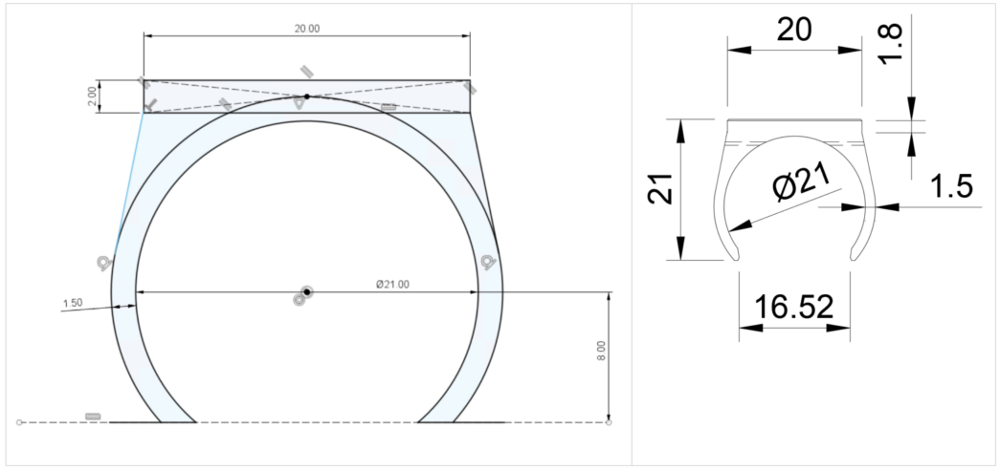
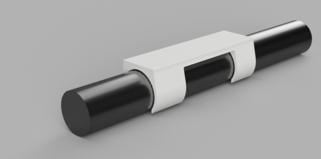
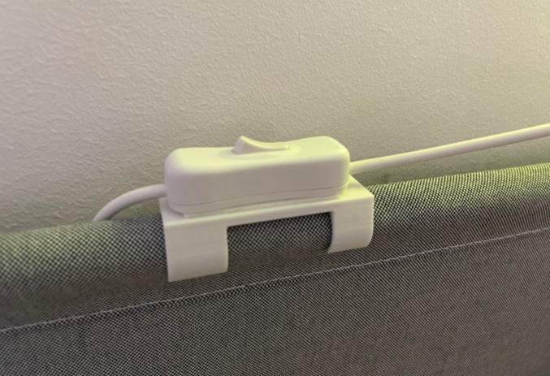

[Back to main](https://haldinc.github.io/)

# Nightlight switch holder - 2021

Alex got a wall mounted nightlight over his bed, but he was concerned that the switch would scratch the wall if it was just hanging. ..and naturally, there is a 3D printed solution for this problem too :) So I designed this snap-on holder that fits on his bed and can hold the power switch.

The final result: 

 Fast and simple solution and even approved by the kiddo.  …apart from the fact that he now wants it in red PLA. 

[Back to main](https://haldinc.github.io/)
