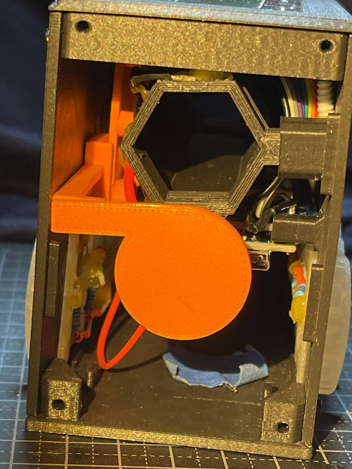
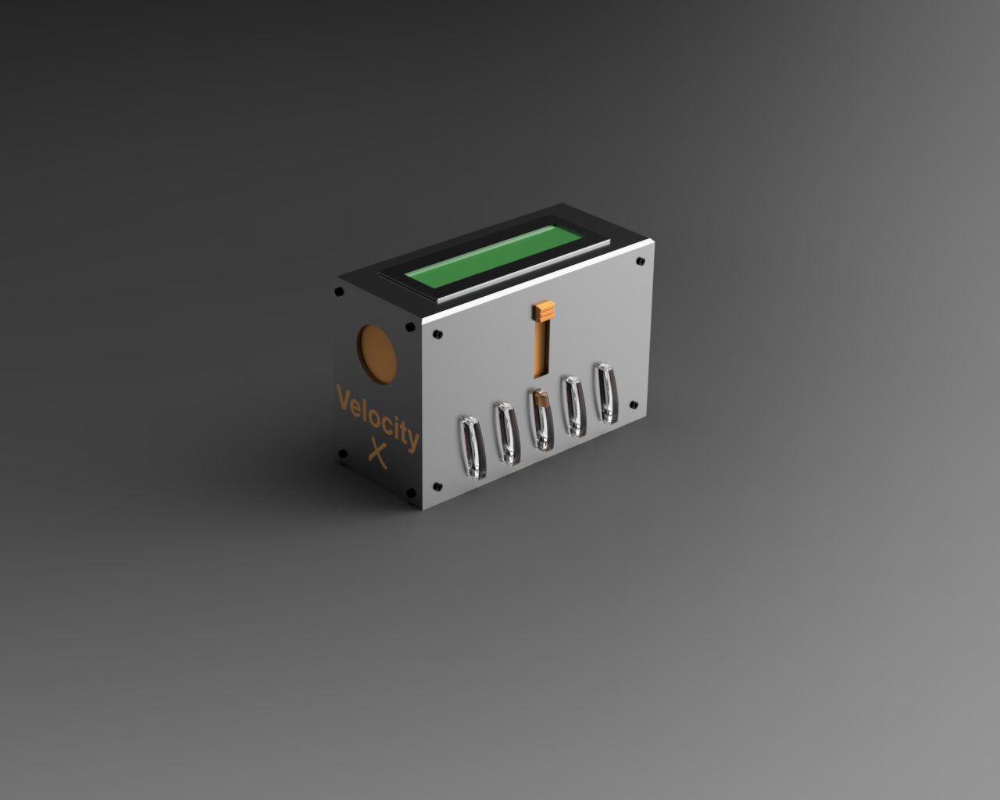

[Back to main](https://haldinc.github.io/)

# VelocityX 2026

  

  <small><i>Click to check out the video on YouTube</i></small>

---

One of the kids got a Nerf gun for Christmas. Not one of those that looks like a killer machine, but a unicorn blaster.

This one:  
  <!--  gun    -->

After a few shots, the question from my kids arose: How fast is it actually shooting?

I quickly asked the kids back, “Good question—how could you find out?”

Suggestions:  
- 1st suggestion: We can record the sound of firing it into a wall at a known distance and measure the time between the shot and it hitting the wall.  
- 2nd suggestion: We can record a video of the dart passing by and count the frames.  
- 3rd suggestion: We can shoot it past two switches and measure the time difference.  

All good suggestions, mainly from my 9- and 13-year-olds.

We decided to proceed with the 3rd suggestion, but use optical sensors instead of switches, as they will be a non-invasive measurement—and I already had a bag of old H21A1 sensors.

PcC circuit setup - just some resistors for current limit of the sensors. All the other stuff on the board was for another project.  

  
  

We made a quick proof of concept and printed a holder for the two optical sensors with a spacing of 100 mm. This was really a "dirty setup," but that’s how PoCs sometimes are, and it was good enough to show the kids that we could measure it with our "standard household tools."

The two optical sensors were hooked up to their respective oscilloscope channels with rising edge triggering. Even with this simple setup, we could clearly see that the time between the dart passing the first and last sensor was 4.66 ms. As the flight distance is 100 mm, this corresponds to 21.46 m/s. We got our first speed measurement!

---

<!-- ---------------------------------------------------------------------------------------------------------------------------------------------------------  -->

   <!-- render of battery pack  -->

    <!-- Render version of the final     -->

   <!--  in Fusion     -->

  <!--  battery pack IRL    -->

  <!--  optical sensor    -->

  <!--  switch and leaver IRL    -->

  <!--  First light test    -->

  <!--  light connection    -->

  <!--  shutter IRL    -->

  <!--  Ociliscope after gates    -->

  <!--  Final IRL    -->

  <!-- Sensors as drawing     -->

  <!-- Render of sensors and velocity tube     --> 

 <!-- Render of sensors and velocity tube  - from Fusion    --> 

  <!-- Shutter assembly     -->

  <!-- Final rander     -->

# Time to start printing:

