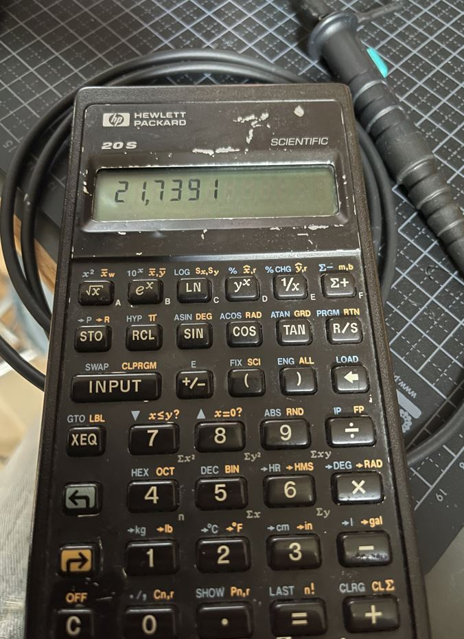

[Back to main](https://haldinc.github.io/)

# VelocityX 2026

One of the kids got a Nerf gun for Christmas. Not one of those that looks like a killer machine, but a unicorn blaster.

This one: (show photo here)

After a few shots, the question from my kids arose: How fast is it actually shooting?

I quickly asked the kids back, “Good question—how could you find out?”

First suggestion:
1st suggestion: We can record the sound of firing it into a wall at a known distance and measure the time between the shot and it hitting the wall.
2nd suggestion: We can record a video of the dart passing by and count the frames.
3rd suggestion: We can shoot it past two switches and measure the time difference.

All good suggestions, mainly from my 9- and 13-year-olds.

We decided to proceed with the 3rd suggestion, but use optical sensors instead of switches, as they will be a non-invasive measurement—and I already had a bag of old H21A1 sensors.

<!-- ---------------------------------------------------------------------------------------------------------------------------------------------------------  -->

   <!-- render of battery pack  -->

    <!-- Render version of the final     -->

   <!--  in Fusion     -->

  <!--  Ociliscope first test    -->

  <!-- calculator     --> 

  <!--  first circut test     -->

  <!--  battery pack IRL    -->

  <!--  optical sensor    -->

  <!--  switch and leaver IRL    -->

  <!--  First light test    -->

  <!--  light connection    -->

  <!--  shutter IRL    -->

  <!--  Ociliscope after gates    -->

  <!--  Final IRL    -->

  <!-- Sensors as drawing     -->

  <!-- Render of sensors and velocity tube     --> 

 <!-- Render of sensors and velocity tube  - from Fusion    --> 

  <!-- Shutter assembly     -->

  <!-- Final rander     -->

# Time to start printing:

